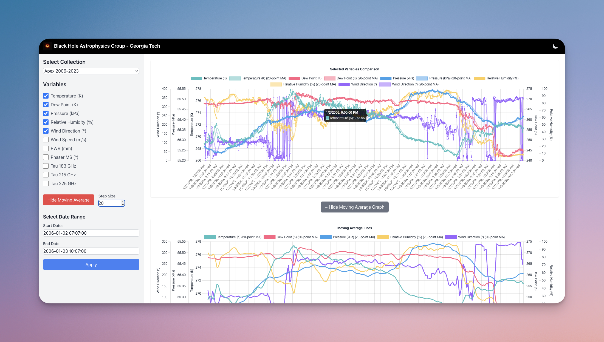
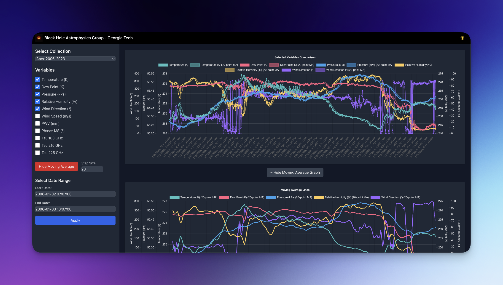

# EHT-WeatherViz: Event Horizon Telescope Meteorological Analytics Platform




## Project Description:
EHT-WeatherViz is a comprehensive web-based platform for analyzing, visualizing, and correlating meteorological data across the global network of Event Horizon Telescope observation sites. This interactive dashboard enables astronomers and researchers to explore critical atmospheric parameters affecting telescope performance, including temperature, pressure, humidity, wind conditions, and precipitable water vapor (PWV). With advanced features like time-series analysis, moving averages, anomaly detection, and statistical correlation, the platform supports critical decision-making for observation planning and helps identify optimal conditions for black hole imaging campaigns. Developed by the Black Hole Astrophysics Group at Georgia Tech, this tool integrates weather data from ALMA, APEX, GLT, JCMT, LMT, SMA, and SMT telescopes, providing unified meteorological intelligence for the international EHT collaboration.

# Using Local Data Files with Your Weather Data Application

## 0. Download the data from Dropbox
[Link to the data](https://www.dropbox.com/scl/fo/2l79uaowcjhavr4hn73fp/ABHqy4L6aoGiO6_ZT_WPw3c?rlkey=dtm9rs6xpsmioo2qz27q9ui9u&st=3zg395x3&dl=0)

## 1. Organize Your Local Data

1. Make sure you have a `data` directory in your project:
   ```bash
   mkdir -p /Users/YourUserName/Downloads/data_stream/data
   ```

2. Place your CSV files directly in this directory:
   - `/Users/YourUserName/Downloads/data_stream/data/apex_2006_2023.csv`
   - `/Users/YourUserName/Downloads/data_stream/data/glt_2017_2022.csv`
   - Any other telescope data files

## 2. Import Data into MongoDB

With your Docker environment running, you can import the data:

```bash
# Navigate to your project directory
cd /Users/YourUserName/Downloads/data_stream

# Start Docker services if not already running
docker-compose up -d

# Import the data using MongoDB container
docker exec -it data_stream-mongodb-1 mongoimport --db data_stream --collection apex_2006_2023 --type csv --file /app/data/apex_2006_2023.csv --headerline
docker exec -it data_stream-mongodb-1 mongoimport --db data_stream --collection glt_2017_2022 --type csv --file /app/data/glt_2017_2022.csv --headerline
```

## 3. Run Your Application

Your Docker application is now ready to use the imported data:

```bash
# If not already running
docker-compose up
```

The current Docker Compose setup already mounts your local data directory to the containers via these volume configurations:

- Backend: `./data:/app/data`
- Frontend: `./data:/app/data` 

This means any files in your local data directory are automatically available inside the containers.
